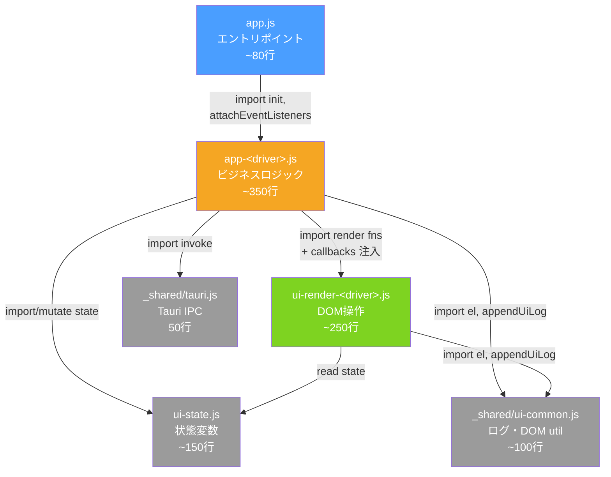

# R-FE-09 ドライバ UI 静的資産分割・ESM化設計書

**ドキュメント ID**: R-FE-09-DESIGN  
**作成日**: 2026年5月20日  
**対象ファイル**: 
- `drivers/joywatcher/ui/assets/app.js` (1,416行)
- `drivers/postgres/ui/assets/app.js` (814行)

---

## 1. 現状分析

### 1.1 ファイルサイズ問題

| ドライバ | ファイル | 行数 | 状態 | 許容値 |
|---------|---------|------|------|--------|
| joywatcher | `app.js` | 1,416 | 🔴 **超過** | 300 |
| postgres | `app.js` | 814 | 🔴 **超過** | 300 |

**超過因**: 単一エントリポイントに以下が混在
- Tauri IPC ラッパー (共通)
- UI ロジック (共通・固有混在)
- DOM 操作 (固有)
- イベントリスナ設定 (固有)
- ステップウィザード制御 (固有)

### 1.2 重複コード分析

#### 完全同一（重複排除済み対象外）
- `drivers/joywatcher/ui/assets/_shared/tauri.js` (46行)
- `drivers/postgres/ui/assets/_shared/tauri.js` (46行)
  - ✅ **既知**: 完全同一だが、後続タスク R-DEDUP-07 で集約予定

#### 部分的共通（抽出候補）
| 機能 | joywatcher | postgres | 共通度 |
|-----|----------|---------|-------|
| ログ API (`appendUiLog`) | ✅ | ❌ | 100% |
| Tauri invoke ラッパ | ✅ | ✅ | 100% |
| DOM ユーティリティ (`el`) | ✅ | ✅ | 100% |
| エラーハンドリング | ✅ | ✅ | 80% |
| ステップ制御 | ✅ | ✅ | 50% (ステップ数異なる) |

---

## 2. 設計戦略

### 2.1 モジュール分割方針

**戦略**: 共通ロジックを中央ライブラリ化し、ドライバ固有ロジックは `app-<driver>.js` として分離

```
drivers/
├── joywatcher/ui/assets/
│   ├── app.js (500行) → ui-host 呼び出しのみ
│   └── _shared/
│       ├── tauri.js (移行対象: 共有フォルダへ)
│       ├── ui-state.js (NEW: ステップ状態管理)
│       ├── ui-render.js (NEW: DOM 操作)
│       └── app-joywatcher.js (NEW: joywatcher 固有ロジック)
├── postgres/ui/assets/
│   ├── app.js (500行) → ui-host 呼び出しのみ
│   └── _shared/
│       ├── ui-state.js (NEW: ステップ状態管理)
│       ├── ui-render.js (NEW: DOM 操作)
│       └── app-postgres.js (NEW: postgres 固有ロジック)
│
└── _shared-assets/ (NEW: 全ドライバ共通, 最終的には drivers/docs/assets/ へ)
    ├── tauri.js (共有版)
    ├── ui-common.js (ログ、DOM util、共通エラーハンドリング)
    └── ui-stepper.js (ステップウィザード共通フレームワーク)
```

### 2.2 ESM 化方針

**現状**: ブラウザ ESM サポート（`<script type="module">`）
- ✅ 既に import/export 構文を使用
- ❌ 長いファイルを分割していない

**目標**: 各モジュール ≤ 200-300行 で責務を分離

| モジュール | 責務 | 行数見積 | 範囲 |
|----------|------|---------|------|
| `tauri.js` | Tauri IPC バインディング | 50 | 共有 |
| `ui-common.js` | ログ、DOM util、エラーハンドリング | 100 | 共有 |
| `ui-stepper.js` | ステップ制御フレームワーク | 80 | 共有 |
| `ui-state.js` | グローバル状態（スキャングループ、タグ等） | 150 | ドライバ共通 |
| `ui-render-<driver>.js` | ドライバ固有の DOM レンダリング | 200-300 | ドライバ固有 |
| `app-<driver>.js` | ビジネスロジック・イベントハンドラ | 250-400 | ドライバ固有 |

### 2.3 モジュール依存関係図

**一方向依存の原則**: 上位モジュールが下位モジュールを import する。逆方向 import は禁止。



**循環参照の発生メカニズムと回避策**:

`renderGroups()` や `renderTables()` などのレンダリング関数は、DOM 内にイベントリスナを埋め込む。そのリスナは `selectGroup()` や `loadGroupIntoEditor()` などのビジネスロジックを呼ぶ。これを単純に実装すると:

```
ui-render-<driver>.js  →  app-<driver>.js  (業務ロジック呼び出し)
app-<driver>.js        →  ui-render-<driver>.js  (renderXxx 呼び出し)
                       ↑ 🔴 循環参照
```

**解決策: コールバック注入パターン**

レンダリング関数は「何を表示するか」の純粋な実装のみ持ち、ビジネスロジックは呼び出し元（`app-<driver>.js`）からコールバックとして注入する。

```javascript
// ✅ ui-render-joywatcher.js  ← ビジネスロジックを import しない
export function renderGroups(scanGroups, selectedGroupIndex, callbacks) {
  // ...
  item.querySelector('.select-group').addEventListener('click', () => {
    callbacks.onSelectGroup(index)   // 注入されたコールバックを呼ぶ
  })
  item.querySelector('.remove-group').addEventListener('click', () => {
    callbacks.onRemoveGroup(index)   // 同上
  })
}

// ✅ app-joywatcher.js  ← callbacks に業務関数を渡す
import { renderGroups } from './ui-render-joywatcher.js'
// ...
function refreshAll() {
  renderGroups(scanGroups, selectedGroupIndex, {
    onSelectGroup: selectGroup,   // 業務関数をここで接続
    onRemoveGroup: removeGroup
  })
}
```

同様のパターンを postgres の `renderTables()` / `renderColumns()` にも適用する。

**callbacks 型一覧（実装時の参照用）**:

| レンダリング関数 | 注入が必要なコールバック |
|---|---|
| `renderGroups(groups, selectedIdx, cbs)` | `onSelectGroup(idx)`, `onRemoveGroup(idx)` |
| `renderTags(group, cbs)` | `onRemoveTag(groupIdx, tagIdx)` |
| `renderTables(tables, groups, activeKey, cbs)` | `onSelectTable(table, group)`, `onEditTable(key)`, `onRemoveTable(key)` |
| `renderColumns(columns, cbs)` | `onSelectTimestamp(name)`, `onToggleField(name, checked)` |

---

### 2.4 モジュール責務分け規則

実装時の判断基準として以下を厳守する。

#### `ui-render-<driver>.js` に入れる関数

- DOM 要素の作成・内容更新・CSS クラス変更
- 状態オブジェクト（引数で受け取る）を UI に反映
- イベントリスナの**登録**（ハンドラ本体は callbacks 経由）
- 純粋な表示計算（`summarizeGroupQuality`, `mapPgTypeToTagType` 等）

```javascript
// ✅ OK: 引数で受け取った値のみで DOM 操作
export function renderGroups(scanGroups, selectedGroupIndex, callbacks) { ... }

// ❌ NG: グローバル変数を直接参照
export function renderGroups() {
  scanGroups.forEach(...)  // 外部 import なしにアクセス不可
}
```

#### `app-<driver>.js` に入れる関数

- Tauri `invoke()` を呼ぶすべての非同期処理
- 状態変数への**書き込み**（`scanGroups = ...`, `selectedGroupIndex = ...`）
- バリデーション（DOM 入力値の確認）
- `renderXxx()` 呼び出しと callbacks 構築
- `init()` と最上位イベントハンドラ

```javascript
// ✅ OK: 状態変更 → render 呼び出し
function selectGroup(index) {
  selectedGroupIndex = index           // 状態変更
  renderGroups(scanGroups, index, callbacks)  // render に渡す
}

// ❌ NG: render 関数が直接状態を変更
export function renderGroups() {
  selectedGroupIndex = ...  // render 関数が状態を変更してはならない
}
```

#### `ui-state.js` に入れる変数・純粋関数

- モジュールスコープの状態変数（`let scanGroups = []` 等）
- 状態を**読む**のみの純粋関数（`activeGroup()`, `totalTagCount()` 等）
- データ変換関数（`restoreScanGroups()`, `buildAutoTag()` 等）
- **状態を変更する関数は含めない**（変更は `app-<driver>.js` が直接行う）

---

### 2.5 CSP 'self' 準拠

**制約**:
- オフライン環境（外部 CDN 不可）
- Content Security Policy: `script-src 'self'`

**解決策**:
- ✅ すべてのロジックはローカルモジュール内
- ✅ `<script type="module">` は `'self'` として扱われる
- ✅ インライン script タグは非使用
- ✅ コールバック注入パターンはランタイムオブジェクト渡しのみ。動的 `eval` 非使用

**検証方法（Phase D-1 完了後）**:
- Tauri dev で各ドライバ UI を起動
- ブラウザ DevTools の Console タブで `Content-Security-Policy` エラーがないことを確認
- Network タブで外部リクエストが発生していないことを確認

---

## 3. 実装フェーズ

### Phase A: 共有ライブラリ準備（共通 2ドライバ）

#### A-1: 共有 `tauri.js` の統一化（R-DEDUP-07 の一部）
- **対象**: `drivers/{joywatcher,postgres}/ui/assets/_shared/tauri.js`
- **アクション**: 中央 `drivers/_shared-assets/tauri.js` に統合
- **インポート更新**: 相対パス `../../../_shared-assets/tauri.js` に統一
- **行数**: 50行
- **依存**: なし

#### A-2: 共有 `ui-common.js` の作成（新規）
**ファイル**: `drivers/_shared-assets/ui-common.js`
**出典**: 
- `drivers/joywatcher/ui/assets/app.js` から `formatLogDetail`, `appendUiLog`, `el`, `clearMessages` を抽出
- `drivers/postgres/ui/assets/app.js` の同等部分

**インターフェース**:
```javascript
export const UI_LOG_LIMIT = 300;
export function formatLogDetail(detail);
export function appendUiLog(level, message, detail = null);
export const el = (id) => globalThis.document.getElementById(id);
export function clearMessageElements(elements);
export function formatUiError(error); // 共通エラー表示
```

**行数見積**: 100行  
**依存**: tauri.js

#### A-3: 共有 `ui-stepper.js` の作成（新規）
**ファイル**: `drivers/_shared-assets/ui-stepper.js`
**出典**: 各ドライバの `setStep()`, stepper イベントハンドラ

**インターフェース**:
```javascript
export let currentStep = 1;
export function setStep(stepNum, onStepChange);
export function attachStepperEvents(onStepSelect);
```

**行数見積**: 80行  
**依存**: ui-common.js

---

### Phase B: ドライバ共通ロジック分離（各ドライバ）

#### B-1: ドライバ共通 `ui-state.js` の作成
**ファイル**: `drivers/{joywatcher,postgres}/ui/assets/_shared/ui-state.js`

**出典**: 各 `app.js` の状態変数
- `launchContext`
- `scanGroups`
- `selectedGroupIndex`
- `isEditMode`
- `browsedTags` / `connectionState` (ドライバ固有)

**インターフェース**:
```javascript
// 共通状態
export let launchContext = null;
export let scanGroups = [];
export let selectedGroupIndex = -1;
export let isEditMode = false;

// ドライバ固有状態は各モジュールで定義
export function initializeState();
export function resetState();
```

**行数見積**: 
- joywatcher: 150行
- postgres: 150行

**依存**: なし

---

### Phase C: ドライバ固有ロジック分割（各ドライバ）

#### C-1: ドライバ固有 `ui-render-<driver>.js` の作成

**ファイル**:
- `drivers/joywatcher/ui/assets/_shared/ui-render-joywatcher.js`
- `drivers/postgres/ui/assets/_shared/ui-render-postgres.js`

**責務**: DOM 操作のみ。§2.4 の責務規則に従う。ビジネスロジックを直接呼ばない。

**joywatcher 出典関数** (~250行):
- `renderGroups(scanGroups, selectedIdx, callbacks)` — グループ一覧 DOM 生成
- `renderTags(group, callbacks)` — タグ一覧 DOM 生成
- `renderDetail(group)` — 詳細パネル更新
- `refreshSummary(scanGroups, launchContext, el)` — サマリカード更新
- `renderReviewAlerts(alerts)` — レビューアラート表示
- `resetGroupForm()`, `populateGroupForm(groupData)` — フォームリセット・復元
- `summarizeGroupQuality(group)` — 純粋計算（renderGroups に使用）

**postgres 出典関数** (~200行):
- `renderTables(tables, scanGroups, activeTableKey, callbacks)` — テーブル一覧 DOM 生成
- `renderColumns(columns, selectedFields, selectedTimestampField, callbacks)` — フィールド一覧 DOM 生成
- `renderGroups(scanGroups)` — グループカウント表示
- `renderReview(scanGroups, conn)` — レビュー画面更新
- `refreshSummary(scanGroups, tables, conn, el)` — サマリカード更新
- `updateModeUi(isEditMode, el)` — モードバッジ更新
- `setStep(step)` — ステップパネル切り替え

**インターフェース（callbacks 型を含む）**:
```javascript
// ui-render-joywatcher.js
export function renderGroups(
  scanGroups: ScanGroup[],
  selectedIndex: number,
  callbacks: { onSelectGroup(idx: number): void, onRemoveGroup(idx: number): void }
): void

export function renderTags(
  group: ScanGroup | null,
  callbacks: { onRemoveTag(groupIdx: number, tagIdx: number): void }
): void

export function refreshSummary(scanGroups, launchContext, el): void

// ui-render-postgres.js
export function renderTables(
  tables: Table[],
  scanGroups: ScanGroup[],
  activeTableKey: string,
  callbacks: {
    onSelectTable(table: Table, existingGroup: ScanGroup | null): Promise<void>,
    onEditTable(key: string): Promise<void>,
    onRemoveTable(key: string): void
  }
): void

export function renderColumns(
  columns: Column[],
  selectedFields: Set<string>,
  selectedTimestampField: string,
  callbacks: {
    onSelectTimestamp(name: string): void,
    onToggleField(name: string, checked: boolean): void
  }
): void
```

**行数見積**:
- joywatcher: 250行
- postgres: 200行

**依存**: `ui-common.js`（el, appendUiLog）, `ui-state.js` 型参照のみ（import なし—引数で受け取る）

#### C-2: ドライバ固有 `app-<driver>.js` の作成

**ファイル**:
- `drivers/joywatcher/ui/assets/_shared/app-joywatcher.js`
- `drivers/postgres/ui/assets/_shared/app-postgres.js`

**責務**: Tauri invoke・状態変更・callbacks 構築・イベントハンドラ・init。§2.4 規則に従う。

**joywatcher 出典関数** (~350行):
- `selectGroup(index)` — 状態変更 + callbacks で renderGroups/renderTags 呼び出し
- `removeGroup(index)` / `removeTag(groupIdx, tagIdx)` — 状態変更 + callbacks 経由 render
- `upsertGroup()` — フォーム値読み取り → 状態更新 → render
- `importBrowsedTags(parsedItems)` — 状態更新
- `browseTags()` — Tauri invoke → importBrowsedTags
- `probeRegisteredTagTypes()` — Tauri invoke → updateDetectedTagTypes → render
- `validateConnection()` — DOM 入力検証
- `saveOutput()` — buildPayload + Tauri invoke
- `attachEventListeners()` — 全ボタンへのリスナ登録
- `init()` — launchContext 取得 + 初期状態復元 + render

**postgres 出典関数** (~300行):
- `loadTables()` — Tauri invoke → 状態更新 → renderTables callbacks 構築
- `loadColumnsForSelectedTable(table, group)` — Tauri invoke → renderColumns callbacks 構築
- `loadGroupIntoEditor(key)` — 状態復元 → renderColumns
- `saveCurrentGroup()` — DOM 読み取り → 状態更新 → render
- `goToStep2()` — バリデーション + loadTables → setStep
- `goToStep3()` — バリデーション + saveCurrentGroup → setStep
- `buildPayload()` — 状態 + DOM 読み取り → 出力オブジェクト生成
- `confirmAndSave()` — buildPayload + Tauri invoke
- `attachEventListeners()` — 全ボタンへのリスナ登録
- `init()` — launchContext 取得 + 初期状態復元 + render

**エクスポート（app.js から呼ばれるもの）**:
```javascript
// 両ドライバ共通
export async function init(): Promise<void>
export function attachEventListeners(): void
```

**行数見積**:
- joywatcher: 350行
- postgres: 300行

**依存**: `ui-state.js`, `ui-render-<driver>.js`, `ui-common.js`, `_shared/tauri.js`

---

### Phase D: エントリポイント統合（各ドライバ）

#### D-1: `app.js` の軽量化
**ファイル**: `drivers/{joywatcher,postgres}/ui/assets/app.js`

**削減前→削減後**: 1,416行 → ~100行（joywatcher）、814行 → ~80行（postgres）

**新しい app.js**:
```javascript
import { appendUiLog, clearMessageElements } from './_shared/ui-common.js';
import { attachEventListeners, init } from './_shared/app-<driver>.js';
import { el } from './_shared/ui-common.js';

const browserWindow = globalThis;

browserWindow.addEventListener('error', (event) => {
  appendUiLog('error', 'window.error', event?.message || 'unknown error')
});

browserWindow.addEventListener('unhandledrejection', (event) => {
  appendUiLog('error', 'unhandledrejection', formatError(event?.reason))
});

// 初期化
attachEventListeners();
void init();
```

**行数**: ~80行（グローバルエラーハンドラのみ）

---

## 4. マイグレーション手順

### 計画の実行順序

```
Phase A-1 (tauri.js 統一)
   ↓
Phase A-2 (ui-common.js 作成)
   ↓
Phase A-3 (ui-stepper.js 作成)
   ↓
Phase B-1 (各ドライバ: ui-state.js 作成)
   ↓
Phase C-1 (各ドライバ: ui-render-<driver>.js 作成)
   ↓
Phase C-2 (各ドライバ: app-<driver>.js 作成)
   ↓
Phase D-1 (各ドライバ: app.js 軽量化・import 統一)
   ↓
✅ 完了（各ドライバ ≤ 300行達成、共有ライブラリ確立）
```

### 各フェーズの行数削減効果

| フェーズ | 対象 | 削減前 | 削減後 | 削減量 | 完成度 |
|---------|------|--------|--------|--------|--------|
| A | 共有ライブラリ準備 | - | +230行 | N/A | 35% |
| B | ui-state.js x2 | - | +300行 | N/A | 50% |
| C | ui-render-<driver>.js x2 | - | +450行 | N/A | 75% |
| C | app-<driver>.js x2 | - | +650行 | N/A | 90% |
| D | app.js x2 軽量化 | 2,230行 | 160行 | **2,070行** | 100% |

---

## 5. 留意点・リスク

### 5.1 オフライン環境・CSP 準拠
- ✅ 本設計は外部 CDN 非依存
- ✅ `<script type="module">` は CSP 'self' で許可
- ✅ すべてのロジックはローカルファイル内

### 5.2 モジュール相互参照
**想定**:
- `app.js` → `app-<driver>.js` → `ui-render-<driver>.js` → `ui-common.js` / `ui-state.js`
- すべて相対パスで循環参照なし

**検証**: 各フェーズ完了後に `npm run build` で ES5 トランスパイルを確認

### 5.3 タウリ UI ホスト統合
- 現在: 各ドライバは独立した HTML + `app.js` をホストする
- 変更後: モジュール分割により、将来 `ui-host` への統合が容易化
- **互換性**: 無し（Phase D 完了後は各ドライバは独立したアセット構成を保持）

### 5.4 デバッグ・保守性
- **利点**: モジュール分割により責務が明確化
- **注意**: DevTools コンソールで複数ファイルの関数呼び出しが表示されるため、ソースマップ構成確認

### 5.5 テスト戦略
- **単体テスト**: 各 `ui-*.js` モジュールに対し Jest テスト追加（Phase C 以降）
- **統合テスト**: ドライバ UI 起動時の init() → event listeners → DOM 更新の流れを確認

---

## 6. 受け入れ条件

### R-FE-09 完了基準

- [ ] A-1: `drivers/_shared-assets/tauri.js` 存在・テスト通過
- [ ] A-2: `drivers/_shared-assets/ui-common.js` 存在・ログ機能動作確認
- [ ] A-3: `drivers/_shared-assets/ui-stepper.js` 存在・ステップ遷移動作確認
- [ ] B-1: 各ドライバ `ui-state.js` 存在・状態初期化確認
- [ ] C-1: 各ドライバ `ui-render-<driver>.js` 存在・DOM 操作確認
- [ ] C-2: 各ドライバ `app-<driver>.js` 存在・イベント処理確認
- [ ] D-1: `app.js` ≤ 100行・全機能動作確認
- [ ] 全体: `cargo fmt` / `npm run check` 通過
- [ ] 全体: 各ドライバ UI を Tauri プレビューで起動・機能テスト成功

---

## 7. 関連タスク

| タスク | 関係 | 状態 |
|-------|------|------|
| R-DEDUP-07 | `_shared-assets/` へ集約 | 後続 |
| R-DEDUP-09 | `joywatcher/` 内重複排除 | 並行可能 |
| Phase 2 | スクリプト責務分離 | 直交 |

---

## 8. 実装スケジュール

**推定作業時間**:
- A-1～A-3: 2～3時間（共有ライブラリ、迷い少）
- B-1: 0.5～1時間 × 2 ドライバ
- C-1: 1～2時間 × 2 ドライバ
- C-2: 2～3時間 × 2 ドライバ
- D-1: 0.5時間 × 2 ドライバ
- 検証・デバッグ: 1～2時間
- **合計**: 15～20時間

**段階的実装**:
1. **第1段**: Phase A (共有ライブラリ) 完成
2. **第2段**: joywatcher フル分割（B-1 → C-1 → C-2 → D-1）
3. **第3段**: postgres フル分割（B-1 → C-1 → C-2 → D-1）
4. **第4段**: 統合テスト・最適化

---

## 付録: 代替案検討

### 代替案 1: コード自動トランスパイル（非採用）
- Webpack / Vite で自動分割？
- **理由**: IoT ハブはオフライン環境。ビルドパイプライン複雑化のメリット < ローカル ESM の簡潔さ

### 代替案 2: 中央 ui-host での統合（後送り）
- 今すぐすべてのドライバ UI を `ui-host` に統合？
- **理由**: 各ドライバの UI 仕様が確定していない。フェーズ 4 以降で再検討

### 代替案 3: ファイル分割なし（非採用）
- 1,416行のままにする？
- **理由**: .copilot-instructions.md §1.1 の 300行ルール違反。保守性悪化。

---

## 終了
このドキュメントは R-FE-09 実装の設計指針です。実装着手時に各フェーズの詳細確認と分割方針の精密化を行います。
