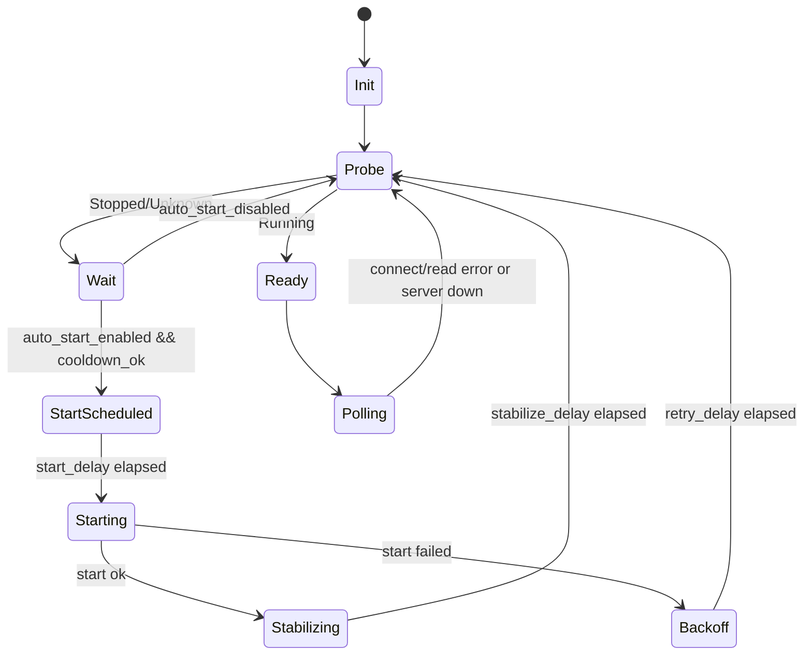

# JoyWatcher サーバ起動制御設計（サービス運用向け）

> 対象: `driver_type = joywatcher`  
> 目的: JoyWatcher サーバ未起動時にドライバ通信を抑止し、状態監視に基づいて遅延付き自動起動する。

## 1. 結論（可否）

可能。既存の `driver-joywatcher` は 2 秒周期で再試行する実装のため、
サーバ停止中でも接続試行が継続する。ここに **サーバ起動ガード層** を追加することで、
未起動時の無駄な通信を避けつつ、安全に自動起動できる。

## 2. 現状の課題

現状（2026-05 時点）:

- `drivers/joywatcher/driver/src/main.rs` は無限ループで `GetDriverDefinition` → bridge 接続 → poll を繰り返す。
- 接続失敗時は `tokio::time::sleep(Duration::from_secs(2))` 後に再試行する。
- JoyWatcher サーバの「起動済み/停止中」を明示的には判定していない。

結果として、サーバ停止中に以下が起こる:

- bridge 側 `connect` / `read` の失敗ログが継続する
- 再試行が短周期で発生する
- 起動制御ポリシー（遅延・上限・クールダウン）が弱い

## 3. 要件定義

### 3.1 必須

1. JoyWatcher サーバ未起動時は読取処理を開始しない。
2. 起動状態を判定できる（Windows サービス優先）。
3. 遅延付き自動起動ができる。
4. 連続失敗時の過剰再起動を防ぐ。
5. 既存構成（TagBus / gRPC / bridge-x86）と互換を維持する。

### 3.2 非目的

- Tauri コマンドの JSON 形変更
- gRPC proto 変更
- JoyWatcher DLL / x86 bridge の ABI 変更

## 4. 全体方針

`driver-joywatcher` のループ先頭に、以下 2 つを追加する。

1. **状態監視（ServerStatusProbe）**
2. **起動制御（ServerStartController）**

`probe` が「利用可能」を返すまで、poll を開始しない。
必要時のみ `start_controller` が自動起動を行い、成功後に安定化待ちを入れて poll へ進む。

### 4.2 実装境界（責務の置き場所）

- JW プロセス監視（`JoyWSrv2` / `JoyWNet2`）は **JoyWatcher ドライバ内部のみ** で実装する。
- 本体（`core/src-tauri`）には JW 固有のプロセス監視ロジックを持ち込まない。
- 本体責務は従来どおり「ドライバプロセスの起動・停止・状態反映」に限定する。

この方針により、他ドライバへの副作用を避け、JW 固有仕様をドライバ境界で閉じ込める。

### 4.1 実測に基づく運用方針（2026-05-26）

観測ログより、以下の挙動を確認済み。

- 常駐待機は `JoyWSrv2.exe`
- `ConnectNet` 実行で `JoyWNet2.exe` が bridge 子として起動
- `JWRead` 中は `JoyWNet2.exe` が継続

このため起動ガードの判定は次を基本とする。

1. 最低条件: `JoyWSrv2.exe` が起動していること
2. 任意追加条件: `JoyWNet2.exe` の起動完了を待つこと

## 5. 状態判定の実装

### 5.1 判定対象（標準）

- 既定では `JoyWSrv2.exe` を監視対象とする。
- `JoyWNet2.exe` は「接続後に起動する補助プロセス」として扱う。
- これらの JW プロセス状態確認は、`auto_start_enabled`（サービス自動起動の有無）に関係なく常時実施する。
  - 目的: 「起動制御」と「稼働状態可視化」を分離し、手動起動運用でも同じ監視品質を保つ。

### 5.2 判定モード（UI チェックボックス対応）

タグ管理の接続先設定 UI で以下を選択できるようにする。

- [ ] `JoyWNet2` 起動完了を待ってから接続する

OFF（既定）:

- `JoyWSrv2` 起動確認のみで接続へ進む（現行互換優先）

ON:

- `JoyWSrv2` 起動確認後、`JoyWNet2` が検出されるまで待機してから接続へ進む

### 5.3 判定優先度

判定優先度は以下。

1. **Windows サービス名** (`service_name`) が設定されている場合
   - Service Control Manager で `Running / Stopped / StartPending` を取得
2. **プロセス名** (`process_name`) が設定されている場合
   - プロセス一覧から存在確認
3. **TCP 到達性** (`endpoint`) が設定されている場合
   - ソケット接続の可否で補助判定

> JoyWatcher の運用が「Windows サービス」である前提なら、`service_name` を正本にする。

## 6. 自動起動の実装

### 6.1 起動トリガ

- `auto_start_enabled = true`
- 直近失敗からクールダウン経過
- 現在状態が `Stopped` または `NotRunning`

### 6.2 起動方式

優先順位:

1. サービス起動（`service_name`）
2. 実行ファイル起動（`server_exe_path`）

### 6.3 遅延・バックオフ

- `start_delay_ms`（初回起動前遅延）
- `stabilize_delay_ms`（起動後の安定化待ち）
- `retry_backoff_base_ms`（指数バックオフ基底）
- `retry_backoff_max_ms`（バックオフ上限）
- `max_start_attempts_per_minute`（起動試行上限）

### 6.4 `JoyWNet2` 待機時の接続手順

`wait_for_joywnet2 = true` の場合、接続シーケンスを以下にする。

1. `JoyWSrv2` の起動確認
2. （必要なら）`JoyWSrv2` の自動起動
3. bridge から `ConnectNet` を実行
4. `JoyWNet2` の出現を待機（`joywnet2_wait_timeout_ms` まで）
5. 検出後に `JWRead` を許可

タイムアウト時は `NotReady` として扱い、バックオフ後に再試行する。

## 7. 設定項目（提案）

`driver.settings`（JoyWatcher 接続先設定）へ以下を追加する。

| キー | 型 | 既定 | 用途 |
| --- | --- | --- | --- |
| `server_monitor_mode` | string | `"service"` | `service` / `process` / `tcp` |
| `service_name` | string | `""` | Windows サービス名 |
| `process_name` | string | `""` | 監視対象プロセス名 |
| `primary_server_process_name` | string | `"JoyWSrv2.exe"` | サーバ起動判定の主対象 |
| `wait_for_joywnet2` | bool | `false` | `JoyWNet2` 起動完了待ちを有効化 |
| `joywnet2_process_name` | string | `"JoyWNet2.exe"` | 待機対象プロセス名 |
| `joywnet2_wait_timeout_ms` | u64 | `5000` | `JoyWNet2` 待機タイムアウト |
| `server_exe_path` | string | `""` | サービスでない場合の起動先 |
| `auto_start_enabled` | bool | `false` | 自動起動有効化 |
| `start_delay_ms` | u64 | `3000` | 起動前遅延 |
| `stabilize_delay_ms` | u64 | `5000` | 起動後安定化待ち |
| `retry_backoff_base_ms` | u64 | `2000` | 再試行基底 |
| `retry_backoff_max_ms` | u64 | `60000` | 再試行上限 |
| `max_start_attempts_per_minute` | u32 | `3` | 起動試行レート制限 |

互換性:

- 既存キー（`endpoint` / `user_id` / `password`）はそのまま。
- 新キー未設定時は従来動作（2 秒再試行）を維持できる。

UI 対応:

- `wait_for_joywnet2` をチェックボックスとして表示する。
- 既定は OFF（既存運用と同じ）。

## 8. 変更ポイント（実装ファイル）

### 8.1 追加

- `drivers/joywatcher/driver/src/server_guard.rs`
  - `ServerStatusProbe` / `ServerStartController` / バックオフ計算
- `drivers/joywatcher/driver/src/server_guard/windows.rs`
  - Windows サービス状態取得と起動処理

### 8.2 変更

- `drivers/joywatcher/driver/src/main.rs`
  - ループ先頭で `server_guard.tick().await` を呼ぶ
  - `Ready` になるまで poll へ進まない
- `drivers/joywatcher/driver/src/joywatcher_runtime.rs`
  - 原則変更なし（読み取りループ自体は維持）

### 8.3 変更しない境界

- `core/src-tauri/src/commands/runtime.rs`
  - JW プロセス監視ロジックは追加しない
- `core/src-tauri/src/drivers/mod.rs`
  - ドライバ共通起動管理の責務は維持し、JW 固有判定は追加しない

## 9. 擬似コード

`main.rs` の主ループを以下の形にする。

1. 定義取得
2. `ServerGuard` に接続設定を渡して `tick`
3. `tick` が `Ready` なら bridge `ConnectNet`
4. `wait_for_joywnet2=true` の場合は `JoyWNet2` 出現待ち
5. 条件成立後に poll / `JWRead` 実行
6. `NotReady` なら guard が返す待機時間で sleep

これにより「未起動時の read 試行」を抑止できる。

## 10. ログ/監視

最低限の構造化ログを追加する。

- `joywatcher.server.status`（running/stopped/unknown）
- `joywatcher.server.autostart.triggered`
- `joywatcher.server.autostart.failed`（理由、次回遅延）
- `joywatcher.server.autostart.succeeded`
- `joywatcher.poll.suppressed`（未起動抑止中）
- `joywatcher.joywnet2.wait.start`
- `joywatcher.joywnet2.wait.timeout`
- `joywatcher.joywnet2.wait.ready`
- `joywatcher.jw_process.snapshot`（`JoyWSrv2` / `JoyWNet2` の検出状態）

補足:

- `joywatcher.jw_process.snapshot` はサービス起動設定に依存せず出力する。
- これにより、手動起動・サービス起動のどちらでも同じ運用ダッシュボードで比較できる。

## 10.1 疑似 Busy 判定（非GUIプロセス向け）

Task Manager の「応答なし」は GUI ウィンドウを持つプロセス向け指標であり、
`JoyWSrv2` / `JoyWNet2` / `driver-joywatcher` のような非GUI主体の監視には直接使いにくい。

そのため本システムでは、以下の合成条件で `suspected_busy` を推定する。

1. `JWRead` 負値エラーが連続閾値以上
2. `JWRead` レイテンシ超過が連続閾値以上
3. bridge `ping` / `read` の応答遅延が連続閾値以上

### 状態モデル

- `not_ready`: `JoyWSrv2` または（設定時）`JoyWNet2` 条件未達
- `ready`: 通常運転
- `suspected_busy`: 応答遅延/失敗が継続
- `fault`: 復帰しない恒常異常（再起動/手動介入対象）

### 設定項目（追加提案）

| キー | 型 | 既定 | 用途 |
| --- | --- | --- | --- |
| `busy_error_streak_threshold` | u32 | `3` | 負値エラー連続で busy 推定 |
| `busy_latency_threshold_ms` | u64 | `1500` | 1回の遅延超過判定閾値 |
| `busy_latency_streak_threshold` | u32 | `3` | 遅延超過連続で busy 推定 |
| `busy_recovery_success_count` | u32 | `2` | 連続成功で busy 解除 |
| `busy_backoff_multiplier` | f64 | `2.0` | busy 中の読取間隔拡大係数 |
| `busy_backoff_max_ms` | u64 | `10000` | busy 中の最大読取間隔 |

### ログ項目（追加）

- `joywatcher.busy.suspected`（理由: error_streak/latency_streak）
- `joywatcher.busy.cleared`（復帰判定）
- `joywatcher.busy.backoff.applied`（適用後scan間隔）
- `joywatcher.busy.fault_escalated`（復帰不能として昇格）

## 11. 失敗時ポリシー

- 起動失敗が連続した場合は指数バックオフ + 上限回数で抑制
- 上限超過時は `warn` を残し、短周期再試行を停止
- ただし監視自体は継続し、手動起動復帰を待つ

Busy 推定時の扱い:

- `suspected_busy` へ遷移したら、読取間隔を段階的に拡大（バックオフ）
- 連続成功で `ready` へ復帰
- 一定時間復帰しない場合は `fault` へ昇格し、明示ログを残す

## 12. テスト計画

### 12.1 ユニット

- バックオフ計算
- 起動試行上限の判定
- `Ready/NotReady` 状態遷移

### 12.2 結合（Windows）

1. サービス停止状態でランタイム起動
2. read が実行されないことを確認
3. 遅延後に自動起動が走ることを確認
4. `wait_for_joywnet2=false` で `JoyWSrv2` 起動のみ確認して接続できることを確認
5. `wait_for_joywnet2=true` で `JoyWNet2` 起動後に poll が開始することを確認
6. `JoyWNet2` が規定時間内に出ない場合に timeout ログと再試行へ遷移することを確認
7. サービス停止で再び抑止に戻ることを確認
8. `JWRead` 負値を連続注入したとき `suspected_busy` へ遷移することを確認
9. Busy 中に scan 間隔が拡大されることを確認
10. 連続成功で `ready` へ復帰することを確認

### 12.3 回帰

- `auto_start_enabled = false` で従来挙動を維持
- PostgreSQL など他ドライバ動作へ影響がないこと

## 13. 段階導入手順

1. `ServerGuard` を導入（監視のみ、起動なし）
2. `auto_start_enabled` を追加（既定 false）
3. 検証環境でサービス起動制御を有効化
4. 運用ログを見て遅延/バックオフ値を調整

## 14. 注意点

- Windows サービス操作 API の採用は依存追加の可能性があるため、導入時に承認を得る。
- サービス名は環境差異があるため、接続先設定で上書き可能にする。
- 自動起動失敗時に機密情報（パスワード等）をログへ出さない。

## 15. 受け入れ条件

- JoyWatcher サーバ停止中、`driver-joywatcher` が `JWRead` 相当の通信を行わない。
- サーバ状態を検知し、設定に応じて遅延付き自動起動できる。
- `wait_for_joywnet2=false` では `JoyWSrv2` 判定のみで接続開始できる。
- `wait_for_joywnet2=true` では `JoyWNet2` 起動完了後に `JWRead` を開始する。
- Busy 推定時に poll 間隔を拡大し、復帰時に通常間隔へ戻せる。
- Busy/Fault の遷移が構造化ログで追跡できる。
- 起動失敗時に過剰リトライしない。
- 既存の通信経路（gRPC / bridge / TagBus）と互換を維持する。

## 16. 運用方針（推奨）: ドライバをサービス起動するか、パブリッシャのみサービス起動するか

### 16.1 推奨結論

初期運用は **「パブリッシャ優先でサービス起動」** を推奨し、
JoyWatcher ドライバは監視条件（`JoyWSrv2` / 任意で `JoyWNet2`）を満たした時に開始する方式が安全。

理由:

1. JoyWatcher 側の負荷/状態に依存するため、ドライバ常時自動起動は再試行負荷を生みやすい。
2. パブリッシャは外部出力経路として安定常駐の価値が高い（接続維持・監視がしやすい）。
3. 本設計の起動ガード（`JoyWSrv2` 監視 + 任意 `JoyWNet2` 待機）と相性がよい。

### 16.2 ただしドライバ常時サービス起動が有効なケース

以下を満たす場合は、ドライバをサービス起動にしてもよい。

- 24/7 連続収集が必須
- `JoyWSrv2` が安定常駐
- `wait_for_joywnet2` と backoff 設定で過負荷時の抑制が確認済み

### 16.3 段階導入案

1. Phase A: パブリッシャのみサービス起動
2. Phase B: ドライバは手動/条件付き自動起動（本ガード有効）
3. Phase C: 安定性実績が取れた接続先のみドライバサービス起動へ拡張

### 16.4 本方針との関係

- 上記いずれの Phase でも、JW プロセス監視は JoyWatcher ドライバ側で実行する。
- サービス起動有無は「起動制御方針」の差分であり、「監視責務の置き場所」は変更しない。
